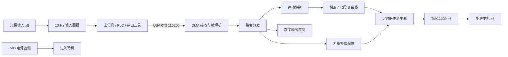
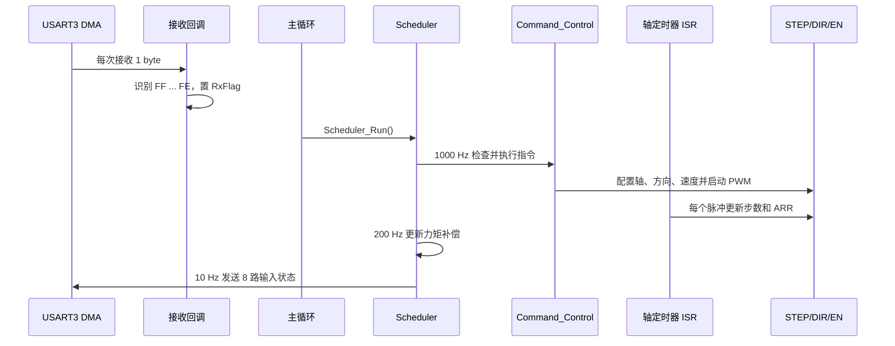

# STM32 六轴步进运动控制卡

基于 `STM32F103RCT6` 的六轴步进电机控制固件，面向 TMC2209 的 `STEP/DIR` 接口，提供梯形加减速、七段 S 曲线、力矩前馈补偿、8 路输入采集和 8 路数字输出。

> 项目定位：可复用的嵌入式运动控制卡固件样例。本文档中的“源码可验证”来自当前工程配置；“实测”仅在有仪器或实机记录时填写，不将理论值当作测试结论。

## 功能概览

- 六轴并行脉冲输出：每轴独立定时器、`STEP/DIR/EN` 控制。
- 两类运动规划：兼容旧协议的梯形加减速、带 Jerk 限制的七段 S 曲线。
- 力矩前馈补偿：每轴 4 点速度—占空比线性插值，可通过串口在线配置。
- 串口控制：USART3，`115200 8N1`，DMA 单字节接收，固定帧头/帧尾协议。
- IO：8 路输入每 100 ms 自动回报，8 路输出通过位掩码控制。
- 掉电保护入口：PVD 双边沿中断触发后进入待机模式。

## 系统框图



### 软件分层

| 层 | 目录 | 主要职责 |
|---|---|---|
| 应用层 | `Applications/` | 调度、协议分发、运动曲线、定点数学、力矩补偿 |
| 硬件抽象层 | `Hardware/` | TMC2209 脉冲、串口、输入、输出、PVD |
| 芯片配置层 | `Core/` | CubeMX 生成的时钟、GPIO、DMA、定时器、USART、中断 |
| 芯片驱动 | `Drivers/` | STM32F1 HAL 与 CMSIS |
| 工程文件 | `MDK-ARM/` | Keil uVision / EIDE 工程与启动文件 |

## 硬件与引脚

### 主要规格

| 项目 | 当前配置 |
|---|---|
| MCU | STM32F103RCT6，Cortex-M3，系统时钟 72 MHz |
| 步进驱动 | TMC2209 × 6，使用 STEP/DIR 模式 |
| 运动定时器 | TIM1、TIM8、TIM2、TIM3、TIM5、TIM4 |
| 输入 | 8 路数字输入，端口电平由 `HAL_GPIO_ReadPin()` 读取 |
| 输出 | 8 路数字输出，初始化后默认高电平，输出 1 初始化为低电平 |
| 控制串口 | USART3，PC10/PC11，115200 8N1，无硬件流控 |
| 辅助串口 | UART5，PC12/PD2，当前代码未接入业务协议 |
| 电源监测 | PVD Level 0，双边沿中断，回调中进入 Standby |

### 六轴映射

| 轴 | 定时器通道 | STEP | DIR | EN |
|:--:|---|---|---|---|
| 1 | TIM1 CH1 | PA8 | PC9 | PA9 |
| 2 | TIM8 CH2 | PC7 | PC6 | PC8 |
| 3 | TIM2 CH3 | PB10 | PB2 | PB11 |
| 4 | TIM3 CH3 | PB0 | PC5 | PB1 |
| 5 | TIM5 CH4 | PA3 | PA2 | PA4 |
| 6 | TIM4 CH2 | PB7 | PB6 | PB8 |

### IO 映射

| 编号 | 输入 | 输出 |
|:--:|---|---|
| 1 | PA15 | PC4 |
| 2 | PA12 | PA7 |
| 3 | PA11 | PA6 |
| 4 | PA10 | PA5 |
| 5 | PB15 | PA1 |
| 6 | PB14 | PA0 |
| 7 | PB13 | PC3 |
| 8 | PB12 | PC2 |

## 任务时序

系统使用基于 `HAL_GetTick()` 的协作式轮询调度器；`SysTick` 为 1 ms，主循环持续调用 `Scheduler_Run()`。电机步进脉冲和速度更新不依赖轮询，而是在各轴定时器更新中断中完成。



| 任务 | 周期 | 当前行为 | 实现位置 |
|---|---:|---|---|
| 指令处理 | 1 ms | 解析并执行串口指令 | `Applications/Scheduler.c` |
| 速度规划预留 | 2 ms | 当前为空，为预计算扩展点 | `Applications/Scheduler.c` |
| 力矩补偿 | 5 ms | 更新运行中各轴占空比 | `Applications/Scheduler.c` |
| 状态监控预留 | 10 ms | 当前为空 | `Applications/Scheduler.c` |
| 预留任务 | 20/50 ms | 当前为空 | `Applications/Scheduler.c` |
| 输入回报 | 100 ms | 发送输入状态帧 | `Hardware/INPUT.c` |
| 心跳预留 | 500 ms | 当前为空 | `Applications/Scheduler.c` |

## 运动控制实现

### 脉冲频率

源码定义 `TIMER_CLK_HZ = 1,000,000`，运行时使用以下关系更新自动重装值：

```text
ARR = TIMER_CLK_HZ / (speed + 1) - 1
```

CubeMX 初始配置为预分频 `72-1`、周期 `200-1`，因此初始更新频率约为 `1 MHz / 200 = 5 kHz`；运动过程中 ARR 会按目标速度动态更新。README 不将“40 kHz”作为当前实测指标，实际最高稳定脉冲频率需在目标板、驱动器和负载上用示波器验证。

### 梯形加减速

`0x01` 默认参数为：起始速度 `800 steps/s`、最高速度 `3200 steps/s`、加速度 `2400 steps/s²`。该路径保留原有浮点计算逻辑，用于兼容旧指令。

### 七段 S 曲线

`0x03` 使用 Jerk 限制的七段速度曲线；短距离由规划器自动退化为 5 段或 3 段曲线。S 曲线 ISR 路径使用定点乘加和查表，配置的默认 `a_max=2400 steps/s²`、`v_max=3200 steps/s`，Jerk 由协议字段乘以 100 得到。

### 力矩前馈补偿

每轴维护 4 个速度—占空比标定点，默认值为：

| 点 | 速度（steps/s） | 占空比 |
|:--:|---:|---:|
| 0 | 0 | 50% |
| 1 | 800 | 55% |
| 2 | 3000 | 65% |
| 3 | 8000 | 75% |

补偿值在调度器中每 5 ms 更新一次，运动中断中每 8 步也会刷新一次。该功能需要根据实际电机、供电和负载重新标定，不能仅凭默认曲线判断“不会丢步”。

## 串口接口说明

### 通用格式

```text
发送：FF | CMD | DATA[0..N-1] | FE
```

- 字节格式：`115200 baud, 8 data bits, 1 stop bit, no parity`。
- 多字节整数均为大端序（高字节在前）。
- 当前接收缓存为 10 字节；协议未实现长度字段、CRC 或转义机制。
- `FF` 为帧头、`FE` 为帧尾，因此 payload 中出现 `FE` 可能影响当前解析状态机；上位机应避免发送保留字节。
- 未知指令被忽略，当前业务层没有统一 ACK/NACK 返回。

### 指令表

| CMD | DATA 长度 | 数据 | 作用 |
|---|---:|---|---|
| `01` | 5 | `MOTOR MODE DIR STEPS_H STEPS_L` | 梯形/恒速/停止控制 |
| `02` | 1 | `MASK` | 8 路输出控制 |
| `03` | 8 | `MOTOR MODE DIR STEPS_H STEPS_L V0_H V0_L JERK` | S 曲线或梯形控制 |
| `04` | 5 | `AXIS INDEX DUTY SPD_H SPD_L` | 设置力矩补偿标定点 |
| `05` | 2 | `AXIS EN` | 使能/禁用某轴补偿 |
| `10` | 1 | `AXIS` | 读取某轴状态 |

### `0x01` 梯形/兼容控制

```text
FF 01 MOTOR MODE DIR STEPS_H STEPS_L FE
```

| 字段 | 取值 |
|---|---|
| `MOTOR` | `1..6` |
| `MODE` | `01` 恒速；`02` 定步；`03` 停止 |
| `DIR` | `01` 正向；`00` 反向 |
| `STEPS` | 恒速模式表示速度；定步模式表示步数，`U16` |

示例：1 轴正向运行 2000 步：

```text
FF 01 01 02 01 07 D0 FE
```

### `0x02` 输出控制

```text
FF 02 MASK FE
```

`MASK.bit0` 对应输出 1，`MASK.bit7` 对应输出 8。当前驱动代码直接写入 GPIO，电气有效电平取决于板级输出电路；不要仅根据变量名推断外部负载的有效电平。

### `0x03` S 曲线控制

```text
FF 03 MOTOR MODE DIR STEPS_H STEPS_L V0_H V0_L JERK FE
```

| 字段 | 取值 |
|---|---|
| `MOTOR` | `1..6` |
| `MODE` | `04` S 曲线；其他值进入梯形路径 |
| `STEPS` | 目标步数，`U16` |
| `V0` | 起始速度，低于 100 时被钳制为 100 steps/s |
| `JERK` | 协议值 × 100，低于 100 时内部使用 500 |

示例：1 轴 S 曲线正向 2000 步、起始速度 500、Jerk 2000：

```text
FF 03 01 04 01 07 D0 01 F4 14 FE
```

### `0x04` / `0x05` 力矩补偿

```text
FF 04 AXIS INDEX DUTY SPD_H SPD_L FE
FF 05 AXIS EN FE
```

`INDEX` 范围为 `0..3`，`DUTY` 建议范围为 `32..95`，`SPD` 为 `U16 steps/s`；`EN=01` 使能，`EN=00` 禁用。当前实现由函数内部处理输入，协议层未返回参数错误码。

### `0x10` 状态读取

```text
请求：FF 10 AXIS FE
返回：AA AXIS MODE CUR_H CUR_L TGT_H TGT_L SPD_H SPD_L DUTY 55
```

返回字段中的步数和速度均为 `U16`。运动完成后当前实现会将当前步数和目标步数清零，并停止对应定时器。

### 自动输入回报

每 100 ms 发送：

```text
FF STATE FE
```

`STATE.bit0..bit7` 分别对应输入 1..8，读取值为 GPIO 电平。回报由 `Loop_10Hz()` 触发。

## 构建与下载

### 环境

- Keil MDK / uVision，工程使用 ARM Compiler 5.06 update 5（AC5）。
- 或 VS Code + EIDE，打开 `MDK-ARM/Motion control card.code-workspace`。
- STM32F1xx device pack 与 ST-Link/CMSIS-DAP 下载器。

### Keil 构建

1. 打开 `MDK-ARM/Motion control card.uvprojx`。
2. 选择 Target `Motion control card`，确认器件为 `STM32F103RC`。
3. 执行 `Rebuild`。
4. 工程配置会生成 ELF 和 HEX；输出目录为 `MDK-ARM/Motion control card/`。
5. 选择对应 Debug/Utilities 下载器后执行 Download。

工程已配置宏 `USE_HAL_DRIVER,STM32F103xE`，包含路径覆盖 `Core/Inc`、`Applications`、`Hardware`、HAL 和 CMSIS。当前仓库未提供可在命令行直接执行的 Makefile/CMake 脚本。

### 上电启动顺序

`main()` 初始化 GPIO、DMA、六组定时器、UART、输出、PVD、定点数学和力矩补偿；随后等待约 10 秒，再启动 USART3 DMA 接收和主循环调度。该延时是当前固件行为，若产品不需要等待外部模块，应单独评估后移除。

## 测试数据与复现方法

### 当前可由源码复核的数据

| 项目 | 结果 | 依据 | 状态 |
|---|---|---|---|
| MCU 主频 | 72 MHz | `Core/Src/main.c` 时钟配置、`.ioc` | 源码可验证 |
| USART3 | 115200 8N1 | `Core/Src/usart.c` | 源码可验证 |
| 定时器计数频率 | 1 MHz | 72 MHz / 72 | 源码可验证 |
| 定时器初始周期 | 200 个计数 | `Core/Src/tim.c` | 源码可验证 |
| 初始更新频率 | 约 5 kHz | 1 MHz / 200 | 计算值，非实测 |
| 输入回报周期 | 100 ms | `Applications/Scheduler.c` | 源码可验证 |
| S 曲线默认 `v_max` | 3200 steps/s | `Applications/control.c`、`Hardware/H_Tmc2209.c` | 源码可验证 |

### 实机测试记录

当前仓库没有单元测试、HIL（硬件在环）测试或自动化测试脚本。建议每次硬件版本发布时至少记录以下数据，并将原始文件放入 `docs/test-data/<board-revision>/`：

| 编号 | 测试项 | 操作 | 通过标准 | 当前状态 |
|:--:|---|---|---|---|
| 1 | 串口帧解析 | 发送 `FF 02 05 FE` | 输出 1、3 响应正确且无额外动作 | 待实测 |
| 2 | 六轴脉冲 | 各轴发送 1000 步指令，示波器测 STEP | 脉冲数量为 1000，方向/使能正确 | 待实测 |
| 3 | 速度频率 | 发送恒速指令，测量 STEP 周期 | 测得值与 `1 MHz/(ARR+1)` 一致 | 待实测 |
| 4 | S 曲线 | 记录 STEP 周期随时间变化 | 无明显速度跳变，短距离可完成 | 待实测 |
| 5 | 输入回报 | 逐路切换 8 路输入 | `STATE` 位序正确，周期约 100 ms | 待实测 |
| 6 | 力矩补偿 | 配置 4 点并改变速度 | Duty 按插值变化，无越界 | 待实测 |
| 7 | 掉电保护 | 在安全条件下触发 PVD | 进入待机，外部负载处于安全状态 | 待实测 |

## 已知问题与边界

- 当前仓库没有单元测试、HIL 测试或 CI 构建流水线，运动精度、最高稳定频率和抗干扰能力尚未形成自动化证据。
- 协议没有长度、校验和、ACK/NACK；帧头/帧尾没有转义，payload 不能安全携带 `0xFE`。
- 协议层没有统一校验轴号、模式、Duty 和步数范围；上位机应先做参数校验，产品化时应补充错误响应。
- `0x01` 梯形路径仍使用浮点逻辑；只有 S 曲线 ISR 路径明确采用定点优化。
- PVD 回调直接进入 Standby，未在进入待机前完成电机停机、输出复位或故障记录；接入真实设备前必须完成安全评审。
- 运动完成后步数清零，状态读取无法保留上一段运动的累计位置；当前模型是“单段目标步数”而不是绝对位置控制。
- `Scheduler.c` 中多个任务仍为空，调度器基于轮询，长时间阻塞调用可能影响低频任务的准时性。
- `Serial3_SendByte()` 为阻塞发送，而输入回报和状态响应在主循环路径中发送；高频通信下需评估对调度的影响。
- `main()` 固定等待约 10 秒，且代码注释提到网口模块，但当前仓库未提供网口驱动说明。
- 输出和 EN 的有效电平取决于板级电路；README 的 GPIO 电平描述不能替代原理图和安全测试。

## 二次开发入口

- 修改轴、输入、输出映射：`Applications/include.c`。
- 修改串口命令分发：`Applications/control.c`。
- 修改任务频率和任务函数：`Applications/Scheduler.c`。
- 修改运动曲线：`Applications/scurve_profile.c/.h`、`Hardware/H_Tmc2209.c`。
- 修改力矩标定逻辑：`Applications/torque_comp.c/.h`。
- 修改 CubeMX 外设配置：`Motion control card.ioc`，重新生成代码后检查用户区改动。

## 版本与复盘建议

每次发布建议保留：固件版本、硬件版本、编译器版本、HEX 文件校验值、测试原始数据、已知问题状态和变更说明。优先补齐“串口协议自动测试 + 脉冲频率实测 + PVD 安全验证”，再考虑引入命令行构建或 CI。

## License

仓库当前未声明独立许可证。公开发布前请补充许可证，并确认 STM32 HAL、CMSIS 与 TMC2209 相关资料的授权范围。
